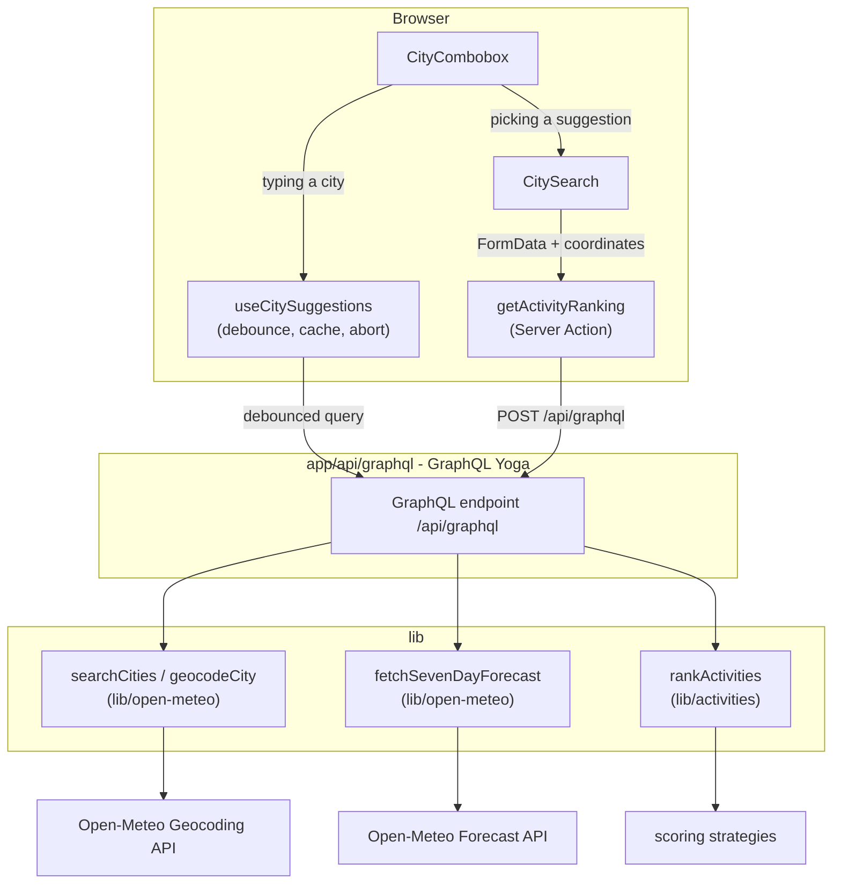

# Sports Weather Check

Type a city and instantly see how good the next **7 days** look for **skiing,
surfing, outdoor sightseeing, and indoor sightseeing** — ranked best to worst
from live [Open-Meteo](https://open-meteo.com/en/docs) weather data.

Built with Next.js 16 (App Router), React 19, TypeScript, Tailwind CSS v4, and a
GraphQL Yoga backend, all in a single deployment.

## Features

- **Activity ranking** — each activity is scored 0-100 per day with a plain-language
  reason ("15.4 h of sunshine at 18.9°C"), then summarized into an overall score,
  rating (Excellent / Good / Fair / Poor), and a best day.
- **City autocomplete** — a debounced, cached combobox suggests matching cities as
  you type, with full keyboard navigation and accessible ARIA semantics.
- **Request-efficient** — autocomplete debounces input, caches results, and aborts
  stale in-flight requests; picking a suggestion reuses its coordinates so the
  forecast skips a redundant geocoding lookup.

## Getting started

Requires Node.js 18.18+ and [pnpm](https://pnpm.io).

```bash
pnpm install
pnpm dev
```

Open [http://localhost:3000](http://localhost:3000) and search for a city.

The GraphQL endpoint lives at [`/api/graphql`](http://localhost:3000/api/graphql);
opening it in a browser serves the GraphQL explorer.

```bash
pnpm dev     # start the dev server (Turbopack)
pnpm build   # production build + type-check
pnpm lint    # eslint
```

## Architecture

A single Next.js app holds both the frontend and a Node GraphQL backend, split
into layers so that data access, business logic, and UI never bleed into each
other.



| Layer | Location | Responsibility |
| --- | --- | --- |
| Data | `lib/open-meteo/` | Typed clients for the Open-Meteo Geocoding and Forecast APIs. Normalizes the API's parallel arrays into one object per day. |
| Domain | `lib/activities/` | Pure scoring logic. Each activity is a `ScoringStrategy` that turns one day of weather into a 0-100 score with a human reason. `rankActivities` aggregates and sorts them. |
| API | `app/api/graphql/` | GraphQL schema + resolvers (GraphQL Yoga) that orchestrate the data and domain layers. |
| UI | `app/` | A Server Component page, a Server Action, and client components for the combobox and ranking display. |

### Project structure

```
app/
  page.tsx                     Server Component: hero + search
  actions.ts                   getActivityRanking Server Action (city or coordinates)
  ranking.ts                   Shared UI-facing types + initial state
  api/graphql/
    route.ts                   GraphQL Yoga route handler
    schema.ts                  SDL type definitions
    resolvers.ts               Orchestrates geocode → forecast → rank
  components/
    CitySearch.tsx             Form + action state + results
    CityCombobox.tsx           Accessible autocomplete input
    useCitySuggestions.ts      Debounced/cached/abortable suggestion hook
    ActivityRankingList.tsx    Ranked results
    ActivityScoreCard.tsx      Per-activity card with 7-day score strip
    format.ts                  Presentation helpers (icons, rating colors, dates)
lib/
  open-meteo/
    geocoding.ts               searchCities + geocodeCity
    forecast.ts                fetchSevenDayForecast
    types.ts                   Location, CitySuggestion, DailyForecast, errors
  activities/
    rank-activities.ts         rankActivities orchestrator
    registry.ts                Single source of truth for activities
    types.ts                   ScoringStrategy, ActivityRanking, etc.
    scoring/                   One file per activity + shared scale helpers
```

### GraphQL API

```graphql
type Query {
  "Autocomplete matches for the search box (client-side, debounced)."
  citySuggestions(query: String!): [CitySuggestion!]!

  "Rank activities for a free-text city (geocodes the name)."
  activityForecast(city: String!): ActivityForecast!

  "Rank activities for an already-resolved location (no geocoding)."
  activityForecastForLocation(location: LocationInput!): ActivityForecast!
}
```

### Technical choices

- **GraphQL via Yoga in a Route Handler.** The required stack is React, Node, and
  GraphQL. GraphQL Yoga runs as a single Web-standard `route.ts` handler, giving a
  self-contained Node backend (with GraphQL) and no separate server process.
- **Two query paths to spare requests.** Free-text submits geocode the name
  (`activityForecast`); selecting an autocomplete suggestion already has its
  coordinates, so it calls `activityForecastForLocation` and skips geocoding.
- **Autocomplete fetches the GraphQL endpoint directly from the client.** Rapid,
  per-keystroke lookups bypass Server Actions (which serialize) and instead use a
  debounced (250ms), cached, abortable `fetch` with a 2-character minimum.
- **React Server Components + Server Action for the ranking.** The forecast lookup
  runs server-side, so no GraphQL client library ships to the browser.
- **Strategy pattern for scoring.** Adding an activity is a single new file in
  `lib/activities/scoring/` registered in `registry.ts`; the GraphQL and UI layers
  need no changes.
- **Plain typed `fetch` over the `openmeteo` package.** The official package returns
  FlatBuffers binary; JSON `fetch` keeps the data layer readable and fully typed.
- **Self-documenting code.** Functions and types are named so the flow reads
  top-to-bottom (`geocodeCity` → `fetchSevenDayForecast` → `rankActivities`)
  instead of relying on comments.

### Scoring model

Each strategy combines a few weighted weather signals (see
[`lib/activities/scoring/scale.ts`](lib/activities/scoring/scale.ts) for the shared
helpers), clamped to 0-100:

- **Skiing** rewards fresh snowfall and sub-zero temperatures; penalizes rain and strong gusts.
- **Surfing** rewards wind-driven swell near an ideal range and mild air; penalizes storms and heavy rain.
- **Outdoor sightseeing** rewards comfortable feels-like temperatures and sunshine; penalizes rain and wind.
- **Indoor sightseeing** is the inverse: bad outdoor weather (rain, cold, wind) raises its desirability.

## How AI assisted

This project was built with an AI coding assistant. AI was used to:

- Scaffold the layered file structure and the repetitive, boilerplate-heavy parts
  (GraphQL SDL, Open-Meteo response typing, Tailwind markup, the accessible combobox).
- Brainstorm each scoring strategy and the relationship between weather signals and
  each sport/activity (which variables matter, and in which direction).
- Draft the first version of each scoring heuristic, later reviewed and hand-tuned
  for sensible weightings and caps.
- Review the code for clarity, structure, and consistency across the layers.
- Draft this README.

AI output was treated as a starting point: the layer boundaries, the strategy
abstraction, and the scoring weights were reviewed and adjusted manually, and the
end-to-end flow was verified against the live API in the browser before finalizing.

## Omissions & trade-offs

Given the time-box, the following were intentionally skipped:

- **Surf uses wind as a wave proxy.** Real swell needs Open-Meteo's separate
  [Marine API](https://open-meteo.com/en/docs/marine-weather-api) (wave height,
  period, direction). The strategy pattern makes this a drop-in upgrade.
- **No caching / rate-limiting layer.** Forecasts are fetched fresh per request.
  Open-Meteo data updates a few times per hour, so a short-lived cache
  (e.g. `use cache` / `cacheLife`) would cut redundant calls.
- **Free-text search uses the top geocoding match.** The autocomplete offers
  disambiguation, but submitting raw text still resolves to the first hit.
- **No automated tests.** The scoring functions are pure and the natural next step
  would be unit tests in `lib/activities/scoring/`.
- **Scoring weights are heuristic.** Reasonable but not calibrated against real
  preference data; they live in one place to make tuning easy.
- **Suggestion cache is per-session and in-memory.** It resets on reload and is not
  shared between users.
